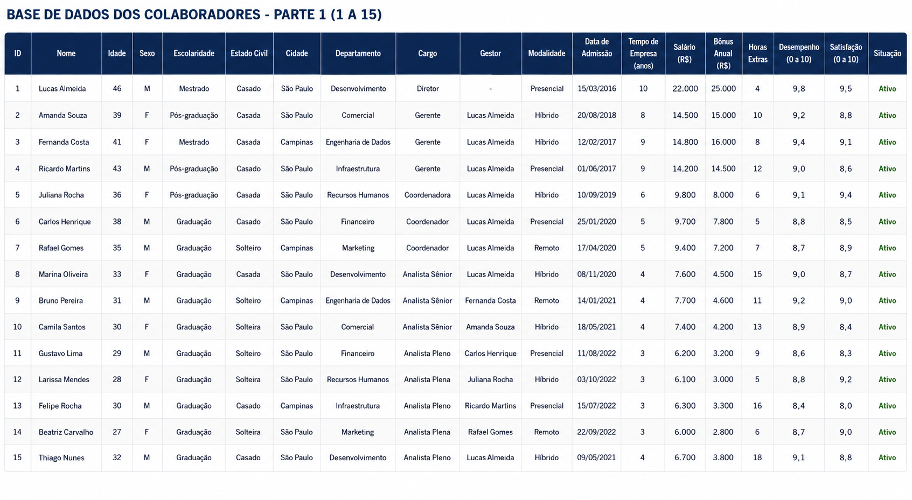
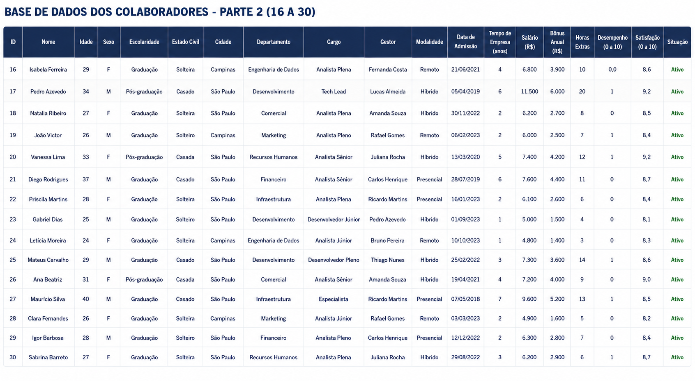

# Base de Dados Disponibilizada

Projeto: **People Analytics Case Study**

Empresa Cliente: **Orion Tech Solutions**

------------------------------------------------------------------------

# Introdução

Este documento apresenta a base de dados disponibilizada pela **Orion Tech Solutions** para o desenvolvimento do projeto **People Analytics Case Study**.

A base reúne informações cadastrais, profissionais e indicadores relacionados aos colaboradores da organização, servindo como principal fonte de dados para todas as análises realizadas durante este estudo.

As informações foram organizadas para representar um ambiente corporativo realista, permitindo a aplicação de técnicas de manipulação, tratamento e análise de dados utilizando a linguagem **R**.

Todos os dados apresentados são fictícios e foram desenvolvidos exclusivamente para fins educacionais e construção de portfólio.

------------------------------------------------------------------------

# Objetivo da Base

A base de dados foi disponibilizada para permitir a realização de análises voltadas ao setor de Recursos Humanos, possibilitando a construção de indicadores que auxiliem na compreensão do perfil dos colaboradores e apoiem futuras tomadas de decisão.

Ao longo deste projeto, esta base será utilizada para aplicação de diferentes conceitos da linguagem **R**, acompanhando a evolução dos conteúdos estudados.

Entre as atividades previstas estão:

- Criação de data frames;
- Manipulação de dados;
- Utilização de operadores;
- Aplicação de estruturas condicionais;
- Cálculos estatísticos;
- Criação de indicadores;
- Visualização de dados;
- Elaboração de relatórios.

------------------------------------------------------------------------

# Estrutura da Base

A base é composta por **30 colaboradores fictícios**, distribuídos entre diferentes departamentos da empresa.

Cada registro representa um colaborador e reúne informações cadastrais, profissionais e indicadores relacionados ao seu vínculo com a organização.

Para facilitar a visualização, a base foi dividida em duas partes.

------------------------------------------------------------------------

# Variáveis Disponibilizadas

Cada colaborador possui as seguintes informações:

- ID;
- Nome;
- Idade;
- Sexo;
- Escolaridade;
- Estado Civil;
- Cidade;
- Departamento;
- Cargo;
- Gestor Responsável;
- Modalidade de Trabalho;
- Data de Admissão;
- Tempo de Empresa;
- Salário;
- Bônus Anual;
- Horas Extras;
- Faltas;
- Avaliação de Desempenho;
- Índice de Satisfação;
- Situação do Colaborador.

------------------------------------------------------------------------

# Base de Colaboradores

## Figura 1 — Base de Dados dos Colaboradores (Registros 1 a 15)

------------------------------------------------------------------------

## Figura 2 — Base de Dados dos Colaboradores (Registros 16 a 30)

------------------------------------------------------------------------

# Considerações

As figuras apresentadas neste documento representam a base de dados inicial disponibilizada pela Orion Tech Solutions para o desenvolvimento deste estudo.

Nas próximas etapas do projeto, essas informações serão utilizadas para a construção do **data frame principal**, servindo como base para todas as análises, manipulações, cálculos estatísticos e indicadores desenvolvidos ao longo do projeto.

Conforme novos conteúdos da linguagem **R** forem sendo estudados, a mesma base será reutilizada para aplicação de técnicas mais avançadas de análise de dados.

------------------------------------------------------------------------

# Observação

Todos os dados apresentados neste documento são fictícios e foram desenvolvidos exclusivamente para fins de estudo e construção de portfólio.

Nenhuma informação representa pessoas, empresas ou organizações reais.
